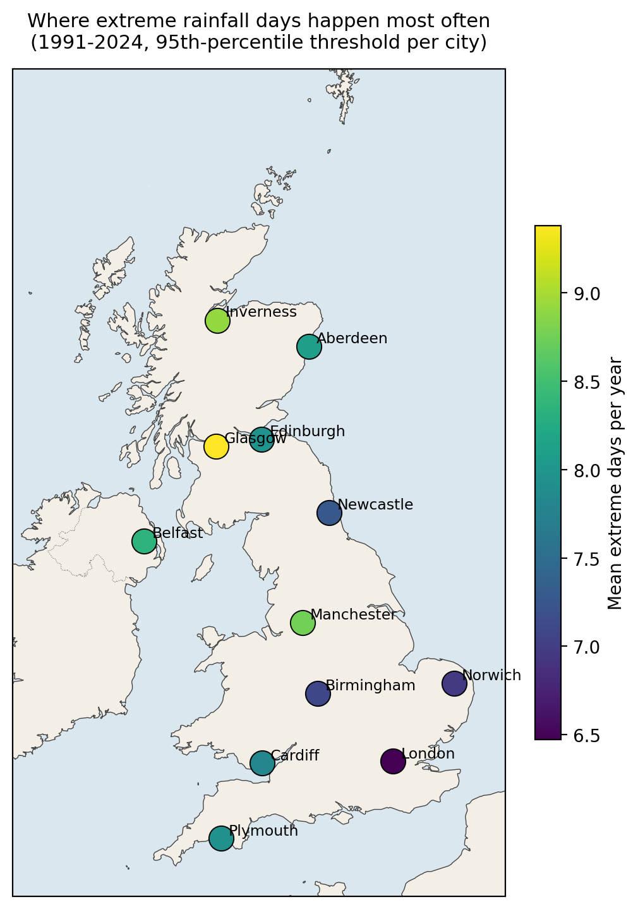
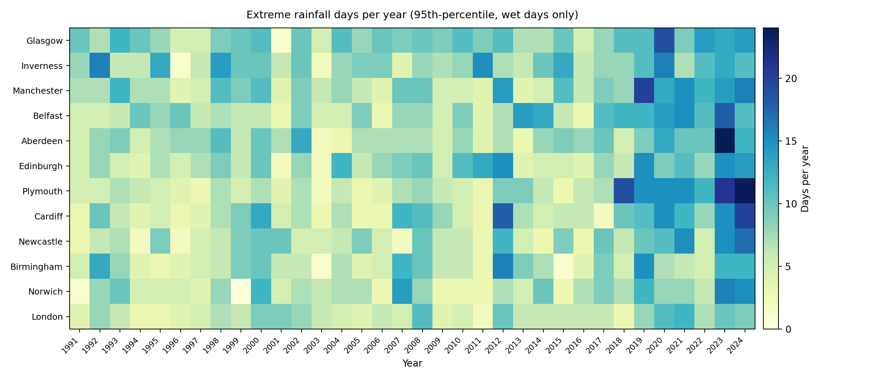
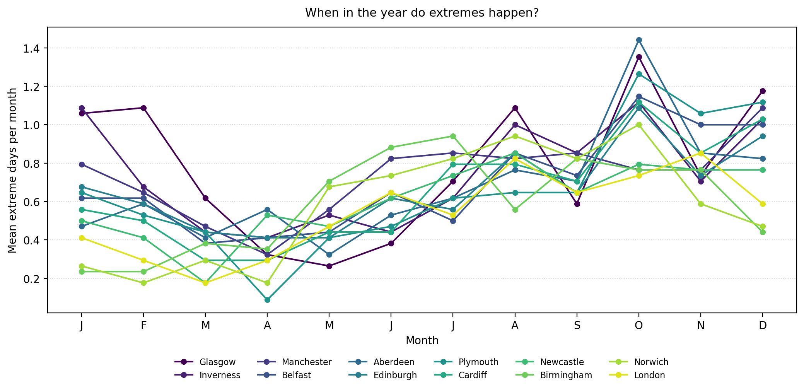
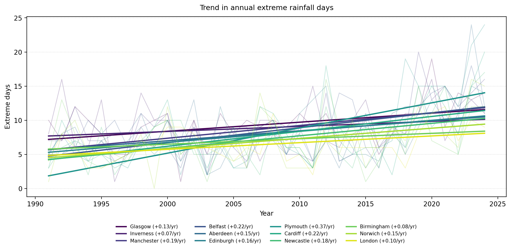

# UK Rainfall Extremes, 1991–2024

A short look at how extreme daily rainfall varies across the UK over the last three decades.

<p align="center">
  <br>
  <em>Figure 1 — Mean annual extreme rainfall days by city.</em>
</p>

## The question

I wanted to see *where* rainfall actually gets extreme, not just where it rains a lot on average, and *when* in the year those days happen. Some places have a high baseline of drizzle, others get most of their rain in sharp bursts, and that distinction gets lost if you only look at annual totals.

Defining "extreme" with one fixed millimetre value would also flatten the picture: 20 mm in a day is unusual in Norwich and pretty routine in Inverness. So I set the threshold separately for each city.

## Data

Daily precipitation for 12 UK cities, 1991–2024, pulled from the [Open-Meteo Historical Weather API](https://open-meteo.com/en/docs/historical-weather-api). Open-Meteo serves ECMWF ERA5 reanalysis data (~25 km grid) through a free, no-key endpoint, which made it the obvious choice for something reproducible.

Cities (chosen for geographic spread, not population): London, Manchester, Birmingham, Cardiff, Edinburgh, Glasgow, Belfast, Plymouth, Newcastle, Aberdeen, Norwich, Inverness.

The script downloads each city's record once and caches it in `data/`, so re-runs are instant.

## Method

1. Keep only "wet days" (≥ 1 mm). This is the standard climate-science cut-off and stops the percentile being dragged towards zero by hundreds of dry days.
2. Take the **95th percentile of wet-day rainfall, per city**, as that city's extreme threshold. This follows the ETCCDI R95p convention used in climate-extremes work.
3. For each city and each year, count the number of days above its threshold.
4. Look at how those counts vary by city, by year, and by month.

## How to run it

```bash
git clone <this-repo>
cd rainfall-extremes-uk
pip install -r requirements.txt
python rainfall_extremes.py
```

First run takes ~30 seconds (one API call per city). After that, everything reads from `data/` and finishes in a few seconds. Figures land in `figures/` and the per-city summary in `outputs/summary.csv`.

## What the figures show

**Figure 1 — Where extremes happen.**  
Each city is coloured by its mean annual count of extreme days. The wet, mountain-shadowed west stands out against the drier east.


**Figure 2 — City × year heatmap.**  
Rows are cities, columns are years, and colour shows the number of extreme days that year. This makes standout years easy to spot.



**Figure 3 — Monthly seasonality.**  
Extreme rainfall days cluster most strongly in autumn and winter, with a clear summer minimum in many cities.



**Figure 4 — Trend over time.**  
Linear fits show descriptive changes in annual extreme-day counts. These are visual summaries, not formal significance tests.



## Limitations

- ERA5's grid is about 25 km, so each "city" is really a grid cell near it. Local micro-climate (rain shadows, urban effects) is smoothed out.
- The 95th-percentile threshold is sensitive to the chosen reference period. Picking 1991–2024 means the threshold itself reflects a warming climate; using a fixed early baseline (e.g. 1961–1990) would give different counts.
- 12 cities is a small sample for the UK. The map shows broad patterns but won't capture, for example, Lake District or Snowdonia maxima where there are no points.
- Trend slopes from a linear fit don't say anything about statistical significance. Treat them as descriptive.

## Possible extensions

- Compare against gauge-based data (UK Met Office HadUK-Grid, 1 km resolution) to see how much the ERA5 smoothing matters.
- Look at multi-day extremes (3-day or 5-day totals) — these often matter more for flooding than single days.
- Bring in the North Atlantic Oscillation index and check whether extreme-day counts track with it.
- Switch from a fixed 95th-percentile threshold to a return-period framing (e.g. the 1-in-10-year wettest day).

## Contact
Any feedback is welcome and encouraged!
- **Find me on:** [LinkedIn](https://www.linkedin.com/in/amy-ariyo-5882ab219)
